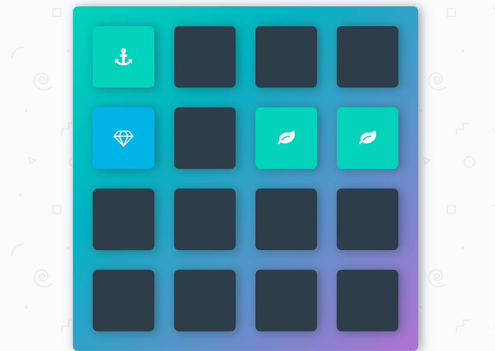

# Memory Game

[Memory Game](https://lucid-haibt-546bda.netlify.com/) is also known under the name of "Concentration". Click the cards to make them flip around and show their symbol. If the symbols of the two flipped cards match, they stay turned and their colour changes. If they don't match, they will be flipped again and show their cardback.


## Table of content

- [Description](#Description)
- [Installation](#installation)
- [Contact](#contact)

## Description

The Memory Game is also known under the name of "Concentration". Click the cards to make them flip around and show their symbol. If the symbols of the two flipped cards match, they stay turned and their colour changes. If they don't match, they will be flipped again and show their cardback.

The goal of the game is to match the cards so that all the cards will be flipped in the end. But watch out! The more moves you make, the less stars you will get in the star rating in the score! Try to open all cards with the fewest moves possible.

And now go and play! How many moves does it take you to succeed?

## Installation

1. Clone the project to your local directory

```
git clone https://github.com/KaushikShivam/concentration
```

2. The project uses NPM for managing dependencies. Run npm install to install all the required dependencies

```
npm install
```

3. Run the task runner to run the app

```
npm run start
```

## Contact

You can contact me at:

- [Portfolio](https://www.shivamkaushik.com)
- [Email](mailto:shivamkaushikofficial@gmail.com)
- [Linkedin](https://www.linkedin.com/in/kshivamdev/)
- [Twitter](https://twitter.com/kShivamDev)
- [Medium](https://medium.com/@shivamkaushikofficial)
- [Angellist](https://angel.co/kshivamdev)
